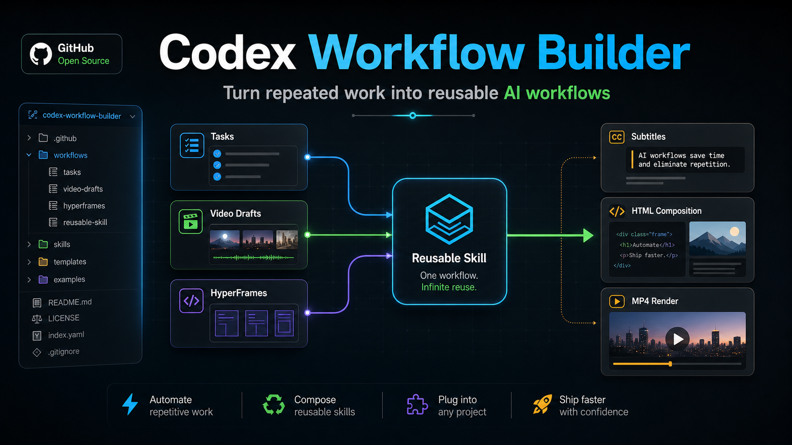

# Codex Workflow Builder



把重复任务、短视频剪辑流程、HyperFrames / Remotion 视频生产管线，整理成 Codex 可以反复执行的 Skill。

这个仓库来自三篇 X 长文的方法论蒸馏，最终沉淀为一个可安装的 Codex Skill：`codex-workflow-builder`。它不是普通教程摘要，而是一个面向真实执行的工作流设计器：当你有一个模糊但反复发生的任务时，它会帮你把目标、输入、输出、目录、步骤、检查点、封装方式全部整理清楚。

## 来源文章

- [5分钟入门Codex，一个工作流在抖音赚了5W+](https://x.com/xilo2991/status/2070051136187621452)
- [Codex自动化剪辑从0到1，开源我在抖音赚了5W+的剪辑工作流【万字长文】](https://x.com/xilo2991/status/2073752063591473242)
- [Codex + HyperFrames 自动剪辑视频：深度技术解析与工程化最佳实践](https://x.com/GeekCatX/status/2074182098626523388)

## 它解决什么问题

很多人使用 Codex 时，容易停留在「问一句，答一句」的模式。但现实工作里，真正有价值的事情往往不是单次问答，而是可重复的流程：

- 每天整理 AI 资讯，生成选题 Brief
- 每周整理数据，输出周报
- 按固定结构写公众号、小红书、短视频脚本
- 用参考视频和素材库批量生成带货短视频草稿
- 把文章、PDF、README 做成带字幕和动效的视频
- 把讲书号、数据科普、工具教程、产品讲解做成日更视频生产线
- 把一个已经跑通的复杂流程封装成 Skill 或自动任务

`codex-workflow-builder` 的作用，就是把这些「说不清、但经常做」的任务，拆成 Codex 能稳定执行的工作流。

## 核心功能

### 1. 重复任务工作流设计

适用于日报、周报、内容生产、资料整理、业务流程等场景。

它会输出：

- 工作流目标
- 触发条件
- 输入材料
- 输出结果
- 项目目录结构
- 执行步骤
- 人工检查点
- 质量标准
- 停止条件
- 是否适合进一步封装成 Skill 或自动任务

典型产物是一个清晰的 `Workflow Contract`：

```markdown
## Workflow Contract
- Goal:
- Trigger:
- Inputs:
- Outputs:
- Project folder:
- Steps:
- Human review points:
- Quality checks:
- Stop conditions:
```

### 2. 参考视频驱动的剪映 / CapCut 草稿流程

适用于电商带货、营销混剪、产品视频、轻量 Vlog、批量短视频生产。

它会把流程拆成：

- 准备参考视频和素材库
- 拆解参考视频镜头
- 提取关键帧
- 生成 `recipe.json`
- 分析每个镜头需要什么素材
- 生成 `fragment_plan.json`
- 从素材库匹配合适素材
- 生成 `matches.json`
- 标记低置信度素材位
- 生成配音和字幕
- 对齐画面、配音、字幕
- 生成预览
- 生成剪映 / CapCut 可编辑草稿

这条路线的关键原则是：

> 宁可留空素材，也不要用无关素材硬凑。

如果某个镜头没有合适素材，Skill 会要求标记为 `missing_asset`，并告诉你应该补充什么类型的素材，而不是为了填满时间线强行选择不相关内容。

### 3. Codex + HyperFrames 视频生产流程

适用于文章转视频、PDF 转视频、README 讲解视频、产品介绍、信息图卡、字幕动效、界面演示、教程类视频。

这条路线的核心分工是：

- Codex 负责：编排、写代码、分镜、字幕、审阅闭环
- HyperFrames 负责：把 HTML / CSS / JavaScript 合成为确定性的 MP4

它会设计完整管线：

```text
Design -> Script -> Storyboard -> HTML Review Page -> Timeline Preview -> Validate -> Render
```

并补齐这些工程步骤：

- 初始化 HyperFrames 项目
- 组织 `assets/`
- 明确视频时长、比例、风格和关键元素
- 编写 HTML 分镜页面
- 根据字幕时间线安排动效
- 预览画面
- 校验合成结构
- 检查素材路径
- 渲染 MP4
- 输出可复现的视频产物

它特别适合浏览器可以表达的内容：字幕、图表、截图、产品页、UI 演示、动效图卡、下三分之一字幕条、数据动画。

### 4. 父子协作：对接 `codex-remotion-daily-video`

当用户要做的不是单条视频，而是长期的视频日更栏目时，本 Skill 不直接吞掉所有细节，而是作为父 Skill 先定义工作流合同，再把视频专项部分交给 `codex-remotion-daily-video`。

父 Skill 负责：

- 判断是否值得工作流化
- 定义触发条件、输入、输出和项目目录
- 明确人工审阅点
- 明确质量检查和停止条件
- 决定是否要封装成 Skill 或自动任务

子 Skill `codex-remotion-daily-video` 负责：

- 判断用 HyperFrames 先做样片，还是直接进入 Remotion 模板
- 选择内容赛道：讲书号、数据科普、工具教程、产品讲解、观点解释等
- 设计内容 JSON schema
- 设计 Remotion composition 和复用组件
- 设计 still frame 检查、渲染检查和发布后复盘

典型父子协作产物：

```markdown
## Workflow Contract
- Goal: 每天把一篇书摘做成 60 秒竖屏讲书视频
- Trigger: 用户把书摘放进 inputs/book-notes/
- Inputs: 书名、金句、核心观点、现实案例、行动建议
- Outputs: content JSON、HyperFrames 样片 brief、Remotion MP4
- Project folder: daily-book-video/
- Human review points: 样片方向、标题、still frame、最终视频
- Quality checks: 字幕安全区、标题长度、时长、封面可读性
- Stop conditions: 缺少书籍信息、缺少授权素材、用户未确认关键数字
- Child skill: codex-remotion-daily-video
```

## 三条路线怎么选

| 需求 | 推荐路线 |
| --- | --- |
| 日报、周报、选题、资料整理 | 重复任务工作流 |
| 有参考视频和素材库，希望生成可编辑草稿 | 剪映 / CapCut 草稿流程 |
| 文章、PDF、README、教程转带字幕动效视频 | HyperFrames 视频流程 |
| 讲书号、数据科普、工具教程、产品讲解日更 | 父子协作：先本 Skill，后 `codex-remotion-daily-video` |
| 需要继续在剪辑软件里精修 | 剪映 / CapCut 草稿流程 |
| 需要可复现 MP4 输出和工程化渲染 | HyperFrames 视频流程 |
| 只问一个简单问题 | 不需要调用本 Skill |
| 高级原创大片、强剧情角色表演 | 不建议用本 Skill 作为主方案 |

## 安装方式

把仓库放到 Codex 的 Skills 目录：

```bash
git clone https://github.com/jackbauerxu/codex-workflow-builder.git ~/.codex/skills/codex-workflow-builder
```

如果你已经有同名目录，可以先备份旧版本，再替换为本仓库。

安装后重启 Codex，Skill 会出现在可用 Skills 中。

## 使用方式

你可以直接说：

```text
用 codex-workflow-builder 帮我把每天整理 AI 资讯并生成选题 Brief 的流程做成工作流。
```

或者：

```text
我有一个爆款参考视频和一批产品素材，帮我设计一个自动生成剪映草稿的 Codex 工作流。
```

或者：

```text
我想用 Codex + HyperFrames 把这篇文章做成 9:16 带字幕和动效的短视频，帮我设计可复用流程。
```

或者：

```text
我想做讲书号日更，先帮我把流程做成 Workflow Contract，再交给 codex-remotion-daily-video 设计样片和 Remotion 模板。
```

Skill 会先判断这个任务是否值得工作流化。如果只是一次性任务，它会建议直接完成任务；如果适合复用，它会继续设计目录、步骤、检查点和封装方式。

## 推荐项目目录

### 通用工作流

```text
project-name/
├── inputs/
├── working/
├── outputs/
├── prompts/
├── logs/
└── RUNBOOK.md
```

### 自动剪辑项目

```text
video-project/
├── AGENTS.md
├── assets/
│   ├── appearance/
│   ├── function/
│   ├── scene/
│   └── human-shot/
└── work/
    └── YYYY-MM-DD/
        ├── reference/
        ├── reference_segments/
        ├── keyframes/
        ├── matched_assets/
        ├── voiceover/
        ├── subtitles/
        ├── preview/
        └── jianying_draft/
```

### HyperFrames 项目

```text
hyperframes-video/
├── AGENTS.md
├── index.html
├── assets/
│   ├── audio/
│   ├── images/
│   ├── video/
│   └── data/
├── scripts/
├── outputs/
│   ├── preview/
│   └── final/
└── notes/
    ├── script.md
    ├── storyboard.md
    └── review-notes.md
```

## Skill 文件说明

```text
codex-workflow-builder/
├── SKILL.md
├── test-prompts.json
├── agents/
│   └── openai.yaml
└── README.md
```

- `SKILL.md`：Codex 实际读取的 Skill 主体。
- `test-prompts.json`：触发测试、非触发测试和边界测试。
- `agents/openai.yaml`：Codex UI 中的显示信息。
- `README.md`：仓库说明文档。

## 适合场景

- 把重复工作整理成 Codex 项目流程
- 把已经跑通的流程封装成 Skill
- 把内容生产流程标准化
- 把短视频批量生产流程拆成可检查步骤
- 把参考视频结构迁移到自己的素材库
- 把文章、PDF、README 做成视频生成流程
- 把 HyperFrames 项目流程标准化
- 把日更视频栏目路由到 `codex-remotion-daily-video`
- 把视频生产从手动时间线操作变成分镜审阅和工程化渲染

## 不适合场景

- 单次简单问答
- 临时写一段短文，不需要复用
- 只想了解 Codex 某个按钮在哪里
- 缺少素材、缺少目标、缺少输出标准的任务
- 强依赖真实表演、复杂镜头语言、精细情绪表达的视频项目
- 主要依赖生成式画面连续演出的项目

## 质量检查

当前版本包含测试用例，覆盖：

- 普通重复任务工作流
- Skill 封装请求
- 剪映 / CapCut 草稿流程
- HyperFrames 视频流程
- Remotion 日更视频父子协作路由
- 不应触发的简单问答
- 不适合自动剪辑的高要求原创视频
- 不适合 HyperFrames 作为主路线的生成式角色视频
- 边界模糊的内容生产请求

本地校验命令：

```bash
python3 "$HOME/.codex/skills/.system/skill-creator/scripts/quick_validate.py" "$HOME/.codex/skills/codex-workflow-builder"
jq empty ~/.codex/skills/codex-workflow-builder/test-prompts.json
```

## 设计原则

1. 先判断是否值得工作流化，不为了封装而封装。
2. 所有流程都必须有输入、输出、步骤和质量检查。
3. 视频生产必须保留人工审阅点。
4. 自动剪辑时，低置信度素材宁可留空。
5. HyperFrames 路线必须先预览和校验，再做最终渲染。
6. 视频日更路线先由本 Skill 定义合同，再由 `codex-remotion-daily-video` 处理样片、JSON、模板和渲染检查。
7. 只有跑通过至少一次的流程，才建议封装成长期 Skill 或自动任务。

## License

未指定许可证。使用前请根据你的发布和复用需求自行补充许可证文件。
